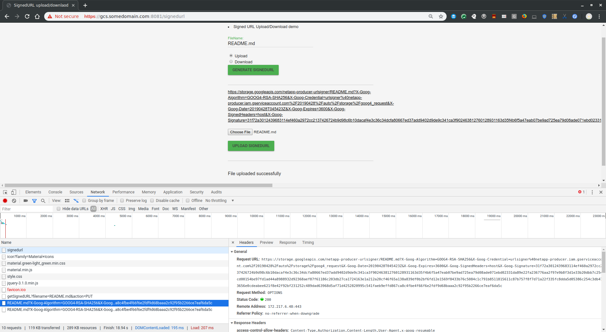
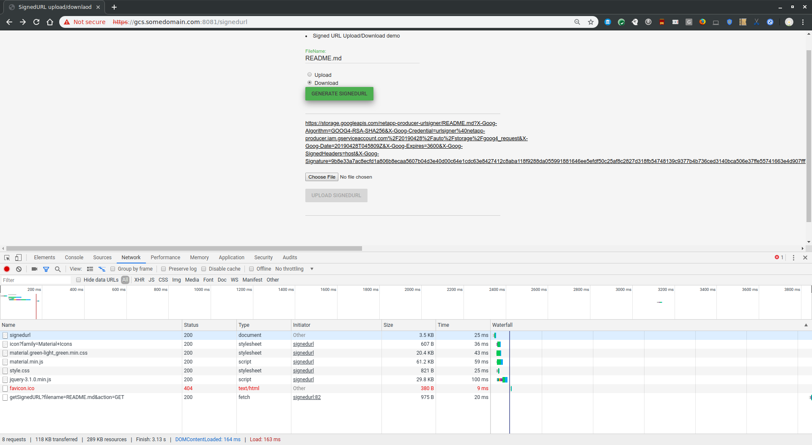
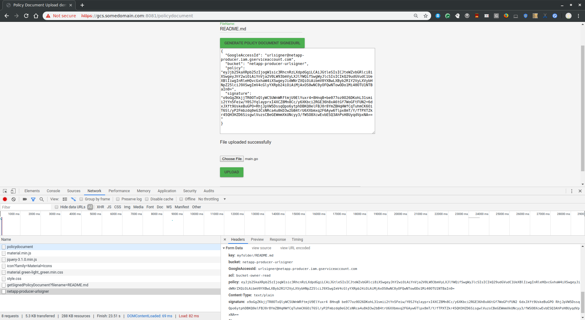

# Upload/Download files from a browser with GCS Signed URLs and Signed Policy Documents

Small javascript application showing how to upload/download files with [GCS Signed URLs](https://cloud.google.com/storage/docs/access-control/signed-urls) and [Signed Policy Documents](https://cloud.google.com/storage/docs/xml-api/post-object#policydocument).  This article will not cover in detail what those two mechanisms are but rather demonstrate a basic application that exercises both on the browser.  This is a simple client-server app that uploads files using these two mechanisms from a user's browser.  SignedURLs w/ javascript has been done many times before (see references); this article describes SignedURLs and Policy document differences and implementations.

Briefly, SignedURLs and Policy Document based operations are similar: a URL with a signature that an unauthenticated user can perform certain GCS operations.  There are a couple of differences to note:

* GCS SignedURLs do not support multiple file uploads with one URL.
* A single Policy document can be used for multiple uploads and also define a prefix/path for all uploads.
* Policy document currently support _uploads_ only. GCS Signed URLS can perform both uploads and downloads.
* Policy documents offer several additional conditions and constraints over SignedURLs (see usage and examples section of the Policy Document)

The code snippet provided here is Flask application that provides signedURLS and Policy documents to a javascript browser.  Snippet also shows how
to configure CORS access for SignedURLs

> Note: this is just a basic sample with some awkward javascript, nothing more.  The sample here allows you to generate URLs to upload+download any file in the bucket by specifying its name.

## Setup 

### Create Service Account

```bash
PROJECT_NAME=$(gcloud config list --format="value(core.project)")

$ gcloud iam service-accounts create urlsigner --display-name="GCS URL Signer" --project=${PROJECT_NAME}

$ gcloud iam service-accounts keys  create service_account.json --iam-account=urlsigner@${PROJECT_NAME}.iam.gserviceaccount.com
```

### Create GCS Bucket 

```bash
 gsutil mb gs://$PROJECT_NAME-urlsigner
```


### Assign IAM permissions on bucket to Service Account

```
gsutil iam ch  serviceAccount:urlsigner@${PROJECT_NAME}.iam.gserviceaccount.com:roles/storage.admin gs://$PROJECT_NAME-urlsigner
```


## GCS SignedURL

### Set /etc/hosts override

Add to `/etc/hosts`.

```
127.0.0.1 gcs.somedomain.com
```

### Set CORS Policy

Set CORS policy to allow request from a test domain:
- `https://gcs.somedomain.com:8081`


- define `cors.txt`:

```json
[
    {
      "origin": ["https://gcs.somedomain.com:8081"],
      "responseHeader": ["Content-Type", "Authorization",  "Content-Length", "User-Agent", "x-goog-resumable"],
      "method": ["GET", "POST", "PUT", "DELETE", "OPTIONS"],
      "maxAgeSeconds": 3600
    }
]
```

- set cors policy on the bucket

```bash
gsutil cors set cors.txt gs://$PROJECT_NAME-urlsigner
```

- Verify:

```bash
curl -v -X OPTIONS -H "Host: storage.googleapis.com" -H "Access-Control-Request-Method: PUT" \
    -H "Origin: https://gcs.somedomain.com:8081" \
    "https://storage.googleapis.com/$PROJECT_NAME-urlsigner/cors.txt"


< HTTP/2 200 
< access-control-allow-origin: https://gcs.somedomain.com:8081
< access-control-max-age: 3600
< access-control-allow-methods: GET,POST,PUT,DELETE,OPTIONS
< access-control-allow-headers: Content-Type,Authorization,Content-Length,User-Agent,x-goog-resumable
< vary: Origin
```


### Set bucket name to sign for

* Edit `main.py`, set 
```
bucketName = '$PROJECT_NAME-urlsigner'
```

(ofcourse use the value, not literal)

### Start Server

```
virtualenv env
source env/bin/activate
pip install -r requirements.txt

python main.py
```

### Access UI to upload/download:


* `https://gcs.somedomain.com:8081/signedurl`

(you may want to enable `Developer Mode` in Chrome; that will show you the CORS requests too)

- Upload
1) Select the `upload` radio button. 

2) Define a filename to generate the URL for (default: `README.md`)

3) Click `Generate Signed URL`.  This will make a request to `/getSignedURL` endpoint which inturn returns a signedURL for the filename specified.

4) Click "Choose File" to select a file to upload.

5) Select "Upload SignedURL"

6) Verify
```
$ gsutil ls gs://$PROJECT_NAME-urlsigner/
gs://$PROJECT_NAME-urlsigner/README.md
```



- Download

1) Select the `download` radio button. 

2) Click `Generate Signed URL`.  This will make a request to `/getSignedURL` endpoint which inturn returns a signedURL for the filename specified.

3) Click the link provided on the browser.  The link will download the file requested

- Download



### Using gsutil 

You can also genereate upload/download urls with gsutil or any `google-cloud-storage` library 

```bash
gsutil signurl -m GET service_account.json gs://$PROJECT_NAME-urlsigner/README.md
gsutil signurl -m PUT service_account.json gs://$PROJECT_NAME-urlsigner/README.md
```

---

## Policy Document

[Policy Document](https://cloud.google.com/storage/docs/xml-api/post-object#policydocument) allows for *uploads only* but also provides several configurations and conditions canonical SignedURLs do not:  you can define a prefix/path with which a user can upload multiple files with one URL.  In the example below, one URL can upload N files to the bucket and each file must have the prefix `/myfolder/` and be of `Content-Type: text/plain`

- Upload

1) Access `https://gcs.somedomain.com:8081/policydocument`

2) Define a filename to generate the URL for (default: `README.md`)

3) Click `Generate Policy Document Signed URL`.  This will make a request to `/getSignedPolicyDocument` endpoint which inturn returns a signed policy document for the filename specified.  The code snippet on the server which generates this is from the `google-cloud-storage` python library [bucket.generate_upload_policy()](https://github.com/googleapis/google-cloud-python/blob/master/storage/google/cloud/storage/bucket.py#L1882)

4) Click "Choose File" to select a file to upload.

5) Select "Upload SignedURL"

6) Verify
```
$ gsutil ls gs://$PROJECT_NAME-urlsigner/myfolder/
gs://$PROJECT_NAME-urlsigner/myfolder/README.md
```



Policy documents can also get embedded into a form as described in the links above and in the snippet below

As an HTML form, you can post the same generated signature, file and policy document.  For example:
```html
<html>
<form action="http://storage.googleapis.com/$PROJECT_NAME-urlsigner" method="post" enctype="multipart/form-data">
    <input type="hidden" name="key" value="myfolder/myfile.txt">   
    <input type="hidden" name="bucket" value="$PROJECT_NAME-urlsigner">
    <input type="hidden" name="Content-Type" value="text/plain">
    <input type="hidden" name="GoogleAccessId" value="urlsigner@${PROJECT_NAME}.iam.gserviceaccount.com">
    <input type="hidden" name="acl" value="bucket-owner-read">
    <input type="hidden" name="policy" value="b64encodedPolicy">
    <input type="hidden" name="signature" value="b64encodedSignature">    
    <input name="file" type="file">
    <input type="submit" value="Upload">
    </form>
</html>
```


## References

* [CSK headers with SignedURLs](https://medium.com/google-cloud/gcs-signed-url-with-customer-supplied-encryption-key-c89740f31855)
* [GCS HMAC Signatures](https://medium.com/google-cloud/gcs-hmac-signedurl-3166b995f237)
* [Google Cloud Storage SignedURL + Resumable upload with cURL](https://medium.com/google-cloud/google-cloud-storage-signedurl-resumable-upload-with-curl-74f99e41f0a2)
* [How to SignURL on GCE|GKE|anywhere without a key (local key, that is)](https://medium.com/google-cloud/how-to-signurl-on-gcp-without-a-key-locally-that-is-56d3f99f8760) 

* Javascript with GCS SignedURLs:

  - [Upload Files to Google Cloud Storage (GCS) From the Browser](https://medium.com/imersotechblog/upload-files-to-google-cloud-storage-gcs-from-the-browser-159810bb11e3)

  - [Uploading files directly to Google Cloud Storage from client-side JavaScript](https://andrewvos.com/uploading-files-directly-to-google-cloud-storage-from-client-side-javascript/)
